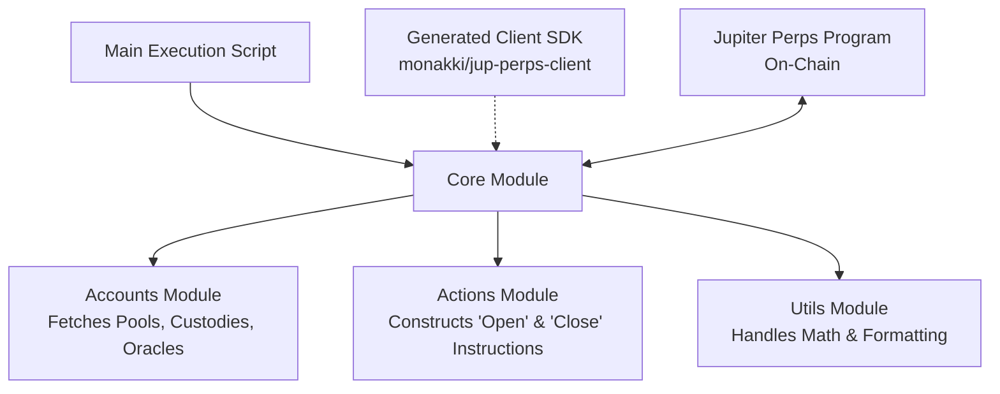

This is the perfect approach. Using **Bun** for speed and a **generated client** to abstract the IDL is the industry standard way to "tame" a complex Solana program. We will treat the Jupiter Perps program as a black box where the generated client handles the raw data structure, and we build a clean service layer on top of it.

We will use the **`monakki/jup-perps-client`** generator because it gives us a robust, auto-generated TypeScript SDK that stays up-to-date with the IDL.

### 🏗️ Architecture: The "Modular Taming" Strategy

Instead of one giant script, we will split the complexity into four distinct modules. This makes your code scalable and easier to debug.



---

### 🛠️ Phase 1: The Setup (Generating the SDK)

First, we need to generate the client that will speak to the Perps program. This shields us from the IDL complexity.

```bash
# 1. Clone the generator repository
git clone https://github.com/monakki/jup-perps-client.git
cd jup-perps-client

# 2. Install dependencies (using Bun as requested)
bun install

# 3. Generate the TypeScript client
bun run generate:js

# 4. The client is now in ./jup-perps-client-js
# We will copy this folder into our project or point to it.
```

### 📂 Phase 2: Project Structure

Create your Bun project:

```bash
mkdir jupiter-perps-bot
cd jupiter-perps-bot
bun init -y
bun add @coral-xyz/anchor @solana/web3.js bs58 @solana/spl-token decimal.js
# Copy the generated folder 'jup-perps-client-js' into this directory
```

Your file structure should look like this:

```text
/src
  /config          # Constants (Program IDs, Wallets)
  /accounts        # Logic to fetch/find complex PDAs
  /actions         # High-level functions (openPosition, closePosition)
  /utils           # Math helpers (BN conversions)
  index.ts         # Main entry point
```

---

### 💻 Phase 3: Implementation

#### **1. `/src/config/index.ts` (The Foundation)**
This handles the boring setup: RPC connection and Wallet loading.

```typescript
import { Connection, Keypair } from "@solana/web3.js";
import { AnchorProvider, Wallet } from "@coral-xyz/anchor";
import bs58 from "bs58";

// Import the generated Program & IDL
import { JupiterPerps } from "../../jup-perps-client-js"; 
import { IDL } from "../../jup-perps-client-js/idl/jupiter-perpetuals";

// Constants
export const JUPITER_PERPS_PROGRAM_ID = new PublicKey("JUP6Fkb6bKbTJ..."); // Replace with actual Program ID
export const RPC_URL = "https://api.mainnet-beta.solana.com"; // Or your QuickNode

// Setup Connection & Wallet
export const connection = new Connection(RPC_URL, "confirmed");
export const keypair = Keypair.fromSecretKey(bs58.decode(process.env.PRIVATE_KEY!));
export const wallet = new Wallet(keypair);
export const provider = new AnchorProvider(connection, wallet, {
  commitment: "confirmed",
});

// Initialize the Program
export const program = new JupiterPerps(IDL, JUPITER_PERPS_PROGRAM_ID, provider);
```

#### **2. `/src/accounts/index.ts` (The Account Resolver)**
This is the most critical file. It abstracts the nightmare of finding the *correct* PDAs (Program Derived Addresses) and Oracle accounts. We will define the logic to find the keys needed for a trade.

*Note: You often need to find the `Custody` account and `Oracle` account for the specific token you are trading (e.g., SOL).*

```typescript
import { PublicKey } from "@solana/web3.js";
import { program } from "../config";

// Helper to find Custody Account PDA
export const findCustodyPDA = async (mint: PublicKey) => {
  // Logic to derive PDA: ['custody', pool_pda, mint]
  // The generated client might provide a helper like program.account.custody... 
  // If not, you derive it manually using anchor's PublicKey.findProgramAddressSync
  const [pda] = PublicKey.findProgramAddressSync(
    [Buffer.from("custody"), /* pool_pda */, mint.toBuffer()],
    program.programId
  );
  return pda;
};

// Helper to find Position PDA
export const findPositionPDA = (owner: PublicKey, custody: PublicKey) => {
  const [pda] = PublicKey.findProgramAddressSync(
    [Buffer.from("position"), owner.toBuffer(), custody.toBuffer()],
    program.programId
  );
  return pda;
};

// Helper to find Oracle Account (This is specific to Jupiter's DOVES oracles)
// You usually hardcode these or fetch them from a config map based on token symbol.
export const getOracleAccount = (symbol: string): PublicKey => {
  const oracles: Record<string, string> = {
    SOL: "39cWjvHrpHNz2SbXv6ME4NPhqBDBd4KsjUYv5JkHEAJU",
    USDC: "A28T5pKtscnhDo6C1Sz786Tup88aTjt8uyKewjVvPrGk",
    // Add others...
  };
  if (!oracles[symbol]) throw new Error(`Oracle for ${symbol} not found`);
  return new PublicKey(oracles[symbol]);
};
```

#### **3. `/src/utils/math.ts` (The Taming of Math)**
Solana uses `BN` (Big Numbers). We need helper functions to convert between Human Readable (e.g., "100.50") and On-Chain Format (6 decimals).

```typescript
import { BN } from "@coral-xyz/anchor";

export const toBN = (amount: number, decimals: number): BN => {
  return new BN(amount * 10 ** decimals);
};

// Calculate Position Size based on Leverage
// Size = Collateral * Leverage
export const calculateSizeUsd = (collateralUsd: BN, leverage: number): BN => {
  return collateralUsd.mul(new BN(leverage));
};
```

#### **4. `/src/actions/position.ts` (The High-Level Logic)**
Here we construct the actual transactions. We use the generated client's instruction builders.

```typescript
import { BN } from "@coral-xyz/anchor";
import { program, connection, wallet } from "../config";
import { findCustodyPDA, findPositionPDA, getOracleAccount } from "../accounts";
import { toBN, calculateSizeUsd } from "../utils";
import { TOKEN_PROGRAM_ID } from "@solana/spl-token";

export interface OpenPositionParams {
  symbol: string;
  collateralUsd: number; // e.g., 100 (USDC)
  leverage: number;       // e.g., 10 (for 10x)
  isLong: boolean;        // true for Long, false for Short
}

export const openPosition = async (params: OpenPositionParams) => {
  const { symbol, collateralUsd, leverage, isLong } = params;

  // 1. Convert Inputs
  const collateralBn = toBN(collateralUsd, 6); // USDC has 6 decimals
  const sizeUsdBn = calculateSizeUsd(collateralBn, leverage);

  // 2. Find Accounts
  // Note: You need to fetch the actual Mint PublicKey for the symbol
  // e.g., SOL Mint = So11111111111111111111111111111111111111111112
  const tokenMint = new PublicKey(getMintAddressForSymbol(symbol)); 
  
  const custodyPda = await findCustodyPDA(tokenMint);
  const positionPda = findPositionPDA(wallet.publicKey, custodyPda);
  const oraclePda = getOracleAccount(symbol);
  
  // 3. Prepare Instruction
  // The generated client will have something like program.instruction.openPosition(...)
  // We need to match the IDL structure exactly.
  
  const ix = await program.methods
    .openPosition({
      sizeUsd: sizeUsdBn,
      collateralUsd: collateralBn,
      side: { long: {} } || { short: {} }, // Enum handling varies by generator
      slippage: toBN(0.5, 4), // 0.5% slippage
    })
    .accounts({
      user: wallet.publicKey,
      position: positionPda,
      custody: custodyPda,
      pool: await findPoolPDA(), // You need to derive the Pool PDA
      oracle: oraclePda,
      tokenProgram: TOKEN_PROGRAM_ID,
      // ... the IDL requires ~15-20 other accounts here (signers, system program, etc.)
      // Check generated client's types for the full list
    })
    .instruction();

  // 4. Send Transaction
  const tx = new Transaction().add(ix);
  const sig = await program.provider.sendAndConfirm!(tx, []);
  console.log("Position Opened! Signature:", sig);
  return sig;
};
```

#### **5. `/src/index.ts` (The Entry Point)**

```typescript
import { openPosition } from "./actions/position";

async function main() {
  try {
    console.log("Starting Jupiter Perps Bot...");

    // Example: Open 10x Long SOL Position with 100 USDC collateral
    const sig = await openPosition({
      symbol: "SOL",
      collateralUsd: 100,
      leverage: 10,
      isLong: true,
    });

    console.log("Success! Transaction:", sig);

  } catch (error) {
    console.error("Error executing trade:", error);
  }
}

main();
```

### ⚠️ Critical Challenges to Watch Out For

1.  **The "Missing Account" Syndrome**: The Jupiter Perps IDL is notorious for requiring a huge list of accounts (System Program, Token Program, Pool, Custody, Oracle, User, Position, etc.). If you miss one, the transaction will fail with a generic error.
    *   **Solution**: The generated client is your best friend here. Use your IDE's IntelliSense on the `.accounts({ ... })` method. It will tell you exactly which keys are required.

2.  **Enums and Types**: `side: { long: {} }` vs `side: true`. The generated client might create Enum objects. Look at the generated types in `jup-perps-client-js` to see how `side` is defined.

3.  **Slippage and Price Limits**: For a market order, you usually pass a `priceLimit` (as a percentage tolerance) or rely on the `slippage` parameter. This is crucial to prevent getting sandwiched.

4.  **Custody and Pool PDAs**: You need to know the "Seed" or "Authority" to derive the Pool account. In Jupiter Perps, there is usually a global "Config" account that serves as the seed for PDAs. You will need to fetch this Config account first using `program.account.config.fetch(...)`, then use its key to derive the rest.

### 🚀 Next Steps (SL/TP)
You mentioned we will tackle Stop Loss (SL) and Take Profit (TP) later. In Jupiter Perps, these are usually implemented via **Limit Orders** or **Post-Only Orders**, not as parameters on the Position itself.

The modular structure we built today allows us to easily add a `createLimitOrder(params)` function later. It will use the same `findPositionPDA` and `findCustodyPDA` helpers, just calling a different instruction (`program.methods.createLimitOrder(...)`).

This approach keeps your bot clean, separating the *math*, the *accounts*, and the *logic*, making it scalable as Jupiter (inevitably) adds more complex features.
